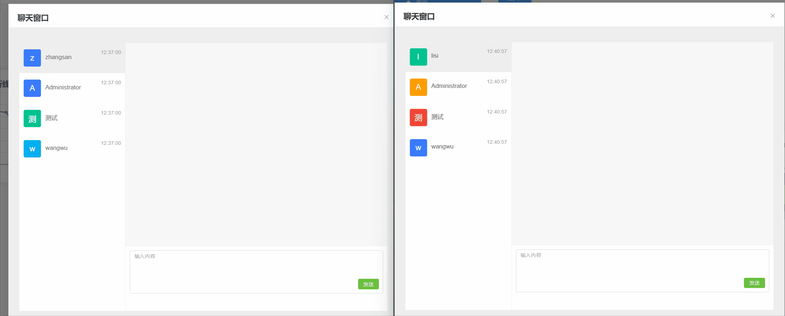
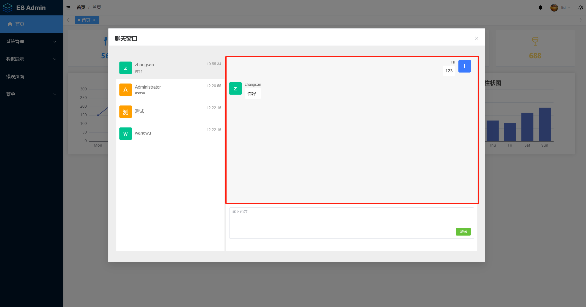
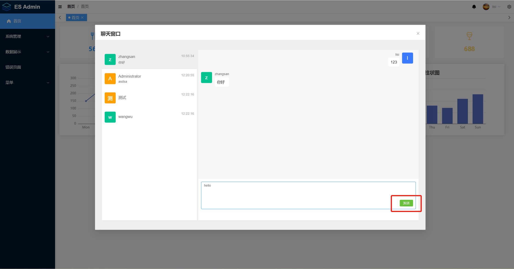

# es-midway-admin

midwayjs基础后台管理系统(七)-即时通讯、使用SocketIO开发聊天功能



[github仓库地址](https://github.com/vangleer/es-midway-admin)

## 使用技术

midwayjs + typeorm + redis

## 现有功能

- 登录注册、验证码
- 用户管理
- 角色管理
- 权限管理
- 文件模块、excel导入导出
- swagger
- 聊天功能

## 具体使用

### 克隆代码到本地

```sh
git clone https://github.com/vangleer/es-midway-admin.git
```

### 启动后端

需提前安装mysql和redis，导入默认数据 src/entity/init.sql（默认路由、配置等）

> 注意：没安装 redis 需要把任务队列相关功能注释

```sh
cd es-midway-admin
yarn
yarn dev
```

### 启动前端

```sh
cd web
yarn
yarn dev
```
访问 http://localhost:3001/


## midwayjs 项目引入 SocketIO

[midwayjs官方介绍](http://midwayjs.org/docs/extensions/socketio)

Socket.io 是一个业界常用库，可用于在浏览器和服务器之间进行实时，双向和基于事件的通信。


### 安装依赖

```sh
npm i @midwayjs/socketio@3 --save
## 客户端可选
npm i @types/socket.io-client socket.io-client --save-dev
```

### 开启组件

```typescript
import { Configuration } from '@midwayjs/core'
import * as socketio from '@midwayjs/socketio'

@Configuration({
  imports: [socketio],
  // ...
})
export class MainConfiguration {
  async onReady() {
    // ...
  }
}

```

Socket.io 实现了两种 Transports（传输方式）

第一种是 HTTP 长轮询。HTTP Get 请求用于 long-running（长连接），Post 请求用于 short-running（短连接）。

第二种是 WebSocket 协议，直接基于 WebSocket [Connection](https://developer.mozilla.org/en-US/docs/Web/API/WebSockets_API) 实现。它在服务器和客户端之间提供了双向且低延迟的通信通道。

我们这里使用的是第二种方式 WebSocket，需要添加一下配置

```typescript
// src/config/config.default.ts

import { MidwayConfig, MidwayAppInfo } from '@midwayjs/core'
export default (appInfo: MidwayAppInfo) => {
  return {
    // ...
    socketIO: {
      transports: ['websocket'],
      // cors: { // 长轮询开启跨域
      //   origin: '*'
      // }
    }
  } as MidwayConfig
}

```

### 目录结构

下面是 Socket.io 项目的基础目录结构，和传统应用类似，我们创建了 socket 目录，用户存放 Soscket.io 业务的服务代码。

```
.
├── package.json
├── src
│   ├── configuration.ts          ## 入口配置文件
│   ├── interface.ts
│   └── socket                      ## socket.io 服务的文件
│       └── hello.ts
├── test
├── bootstrap.js                  ## 服务启动入口
└── tsconfig.json
```

### 基本使用

- 服务端

```typescript
// src/socket/hello.ts

import { WSController, OnWSConnection, Inject, OnWSMessage, WSEmit } from '@midwayjs/core'
import { Context } from '@midwayjs/socketio'

@WSController('/hello')
export class HelloSocketController {

  @Inject()
  ctx: Context

  /**
   * 监听连接
   */
  @OnWSConnection()
  async onConnectionMethod() {
    console.log('on client connect', this.ctx.id)
  }

  /**
   * 接收消息
   */
  @OnWSMessage('words')
  @WSEmit('words')
  async gotMessage(data) {
    console.log('client data: ', data)
    const message = 'hello world from server'
    this.ctx.broadcast.emit('words', message)
    return message
  }
}
```

Socket.io 是通过事件的监听方式来获取数据。Midway 提供了 `@OnWSMessage()` 装饰器来格式化接收到的事件，每次客户端发送事件，被修饰的方法都将被执行。

当获取到数据之后，通过业务逻辑处理数据，然后将结果返回给客户端，返回的时候，我们也是通过另一个事件发送给客户端。

通过 `@WSEmit` 装饰器来将方法的返回值返回给客户端。

- 客户端写法

```typescript
import { onMounted, ref } from 'vue'
import { io, Socket } from 'socket.io-client'

const socket = ref<Socket | null>(null)

onMounted(() => {
  // 建立websocket连接
  socket.value = io('ws://127.0.0.1:7001/hello', { transports: ['websocket'] })
  // 连接成功回调
  socket.value.on('connect', () => {
    console.log('client connected')
    socket.value?.emit('words', 'hello world from client')
  })

  // 监听消息
  socket.value.on('words', (data) => {
    console.log(data)
  })
})
```

上面是 `Socket.io` 在midwayjs中的基本使用，更详细用法请参考官方教程，接下来我们使用 `Socket.io` 来实现一个简单的聊天系统

## 聊天服务端

### chat 表设计

chat 表包含字段有 发送人id、接收人id、发送内容、消息类型 （0:文字 1:图片 2:文件）、状态 （0:未读 1:已读）

新建 `src/entity/chat.ts`

```typescript
import { Entity, Column } from 'typeorm'
import { BaseEntity } from './base'

@Entity('chat')
export class Chat extends BaseEntity {
  @Column({ comment: '发送人id', type: 'int' })
  fromUserId: number
  @Column({ comment: '接收人id', type: 'int' })
  toUserId: number

  @Column({ comment: '发送内容', length: 100 })
  content: string

  @Column({ comment: '消息类型 0:文字 1:图片 2:文件', default: 0, type: 'tinyint'  })
  type: string

  @Column({ comment: '状态 0:未读 1:已读', default: 0, type: 'tinyint'  })
  status: string
}
```

### chat 业务实现如下，新建 `src/service/chat.ts`

```typescript
import { Provide, Inject } from '@midwayjs/core'
import { InjectEntityModel } from '@midwayjs/typeorm'
import { Not, Repository } from 'typeorm'
import { BaseService } from './base'
import { Chat } from '../entity/chat'
import { User } from '../entity/user'
import { Context } from '@midwayjs/web'
@Provide()
export class ChatService extends BaseService<Chat> {
  @InjectEntityModel(Chat)
  entity: Repository<Chat>

  @InjectEntityModel(User)
  userEntity: Repository<User>

  @Inject()
  ctx: Context

  /**
   * 获取和当前聊天对象的聊天记录
   * @param data 用户id和聊天对象id
   * @returns
   */
  async chatList(data) {
    const { fromUserId, toUserId } = data
    // 查询的是 我和你或者你和我的所有聊天记录
    const list = await this.entity
      .createQueryBuilder()
      .where('(fromUserId = :fromUserId AND toUserId = :toUserId) OR (fromUserId = :toUserId AND toUserId = :fromUserId)', { fromUserId, toUserId })
      .getMany()

    return list
  }

  /**
   * 获取用户列表（通讯录）
   * @param userId
   * @returns
   */
  async getUserList(userId) {
    const userList = await this.userEntity.find({ where: { id: Not(userId) } })

    const list = []
    // 遍历查询每个用户最新一条记录
    for (let i = 0; i < userList.length; i++) {
      const user = userList[i]
      const message = await this.entity
        .createQueryBuilder()
        .where('fromUserId = :userId OR toUserId = :userId', { userId: user.id })
        .orderBy('createTime', 'DESC')
        .getOne() || {}

      list.push({ ...user, message })
    }

    return list
  }
}
```

`ChatService` 实现了两个方法 `chatList` 和 `getUserList`

- chatList 获取和当前聊天对象的聊天记录，例如我想和张三聊天，那么这个方法会返回我和张三的所有聊天记录



- getUserList 获取用户列表（类似通讯录列表），这里获取的是user表里除自己以外所有用户并查询各自最新的一条聊天记录


### chat 控制层，新建 `src/socket/chat.ts`

```typescript
import { WSController, OnWSConnection, Inject, OnWSMessage, WSEmit } from '@midwayjs/core'
import { Context } from '@midwayjs/socketio'
import { ChatService } from '../service/chat'
@WSController()
export class HelloSocketController {
  @Inject()
  ctx: Context;

  @Inject()
  service: ChatService
  @OnWSConnection()
  async onConnectionMethod() {
    console.log('on client connect')
  }

  /**
   * 聊天发送记录
   */
  @OnWSMessage('chat')
  @WSEmit('chat')
  async gotMessage(data) {
    const { fromUserId, toUserId, content } = data
    if (!fromUserId || !toUserId) return []

    const chatInfo = { fromUserId, toUserId, content }
    await this.service.add(chatInfo)

    // 使用聊天双方的id建立事件名称
    const ids = [fromUserId, toUserId]
    ids.sort((a, b) => a - b)
    const topic = `${ids[0]}-chat-${ids[1]}`

    // 发送给除了发送者聊天用户
    this.ctx.broadcast.emit(topic, chatInfo)

    // 这里返回的是给发送者
    return chatInfo
  }

  /**
   * 聊天者和聊天对象的记录
   */
  @OnWSMessage('chatList')
  @WSEmit('chatList')
  async chatList(data) {
    const list = await this.service.chatList(data)
    return list
  }

  /**
   * 聊天对象列表（通讯录）
   */
  @OnWSMessage('userList')
  @WSEmit('userList')
  async getUserList(data) {
    const list = await this.service.getUserList(data.userId)
    return list
  }
}

```

主要实现了三个方法

- `chatList` 和 `getUserList` 方法返回的是上面业务层的聊天记录列表和通讯录列表

- `gotMessage` 方法的功能是接收/发送消息

  1. 接收 发送者id，发送对象id，发送内容
  2. 将数据存到数据库中
  3. 用两者的id生成发送事件名称（也可以使用其他规则），这样只有聊天双方能接收到对应的消息



### 前端相关实现

出于篇幅的原因，布局代码和样式就不贴出来了，大家可以到github仓库获取，这里只涉及逻辑实现

- 安装 socket.io 客户端

```sh
npm i socket.io-client
```

- `web/src/components/im/IM.vue` 的逻辑部分

```typescript
import { ref, onMounted, shallowRef, computed, onBeforeUnmount, nextTick } from 'vue'
import { useUserStore } from '@/store'
import { io, Socket } from 'socket.io-client'
import { dayjs, ScrollbarInstance } from 'element-plus'
const userStore = useUserStore()
const message = ref<string>('')
const list = ref<any[]>([])
const userList = ref<any>([])
const chatUser = ref<any>({})
const socket = shallowRef<Socket | null>(null)
const chatTopic = ref('')
const infoRef = ref<ScrollbarInstance | null>(null)
const innerRef = ref<HTMLElement | null>(null)

const messageList = computed(() => {
  return (list.value || []).map(item => {
    return {
      ...item,
      fromUserName: userStore.username,
      toUserName: chatUser.value.username,
      self: +item.fromUserId === userStore.userid
    }
  })
})

/**
 * 点击发送
 */
function handleSendMessage() {
  if (!message.value && !message.value.trim()) return
  socket.value?.emit('chat', {
    fromUserId: userStore.userid,
    toUserId: chatUser.value.id,
    content: message.value
  })
  message.value = ''
}
/**
 * 点击聊天列表
 * @param item
 */
function handleUserClick(item) {
  chatUser.value = item
  getChatList()
}

/**
 * 获取左侧列表
 */
async function getUserList() {
  socket.value?.emit('userList', { userId: userStore.userid }, (data) => {
    userList.value = data
    // 默认与列表的第一位朋友聊天
    chatUser.value = userList.value[0]
    getChatList()
  })
}

// 接收发送的消息
function onChatMessage (data) {
  list.value.push(data)
  setScroll()
}

/**
 * 获取和当前朋友的聊天记录
 */
function getChatList() {
  if (socket.value) {
    socket.value.emit('chatList', {
      fromUserId: userStore.userid,
      toUserId: chatUser.value.id
    }, (data) => {
      list.value = data || []
      setScroll()
    })

    // 使用聊天双方的id建立事件名称，需要和后端一致
    const ids = [userStore.userid, chatUser.value.id]
    ids.sort((a, b) => a - b)
    const topic = `${ids[0]}-chat-${ids[1]}`

    // 取消前一次的监听
    socket.value.off(chatTopic.value, onChatMessage)
    // 重新监听
    socket.value.on(topic, onChatMessage)
    chatTopic.value = topic
  } else {
    list.value = []
  }
}

function setScroll() {
  nextTick(() => {
    infoRef.value?.setScrollTop(innerRef.value?.clientHeight || 9999)
  })
}
onMounted(() => {
  // 建立websocket连接
  socket.value = io('ws://127.0.0.1:7001', { transports: ['websocket'] })
  // 连接后获取左侧列表
  socket.value.on('connect', () => getUserList())

  // 监听自己的发送
  socket.value.on('chat', onChatMessage)
})

onBeforeUnmount(() => {
  socket.value?.close()
})
```

几个注意点

1. 在 `onMounted` 中与服务的建立连接 transports 需要和客户端保持一致，如果服务端的 `@WSController()` 装饰器加了namespace，客户端也需要加上

2. 在 `getChatList` 方法中，由于每次切换聊天对象都需要重新定义接收消息的topic，需要把前一次的监听移除


## 最后

以上只是聊天功能的简单模板，有许多细节的地方并没有涉及，例如已读未读状态，发送图片和文件等。可以根据具体的需求扩展
