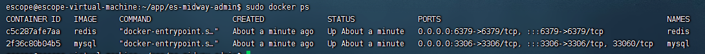
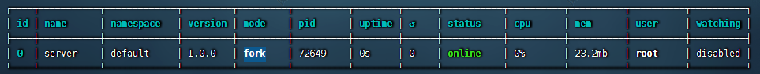
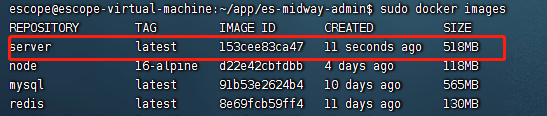
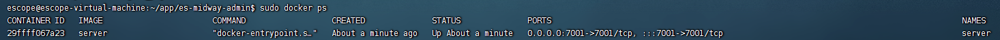

# es-midway-admin

midwayjs基础后台管理系统(八)-使用pm2、docker/docker-compose部署

这篇文章将会介绍 3 种部署方式

1. 使用 pm2 部署
2. 使用 Docker 部署
3. docker-compose 集成

### 部署的流程

整个部署分为几个部分，由于 Midway 是 TypeScript 编写，比传统 JavaScript 代码增加了一个构建的步骤，整个部署的过程如下。


由于部署和平台、环境非常相关，下面我们都将以 ubuntu 来演示，其他平台可以视情况参考。

### 准备工作

由于项目依赖mysql和redis，我们需要提前安装好

这里为了方便就直接使用docker了，如果还没安装docker的可以先安装起来

- 启动 mysql，这里密码设置的和我们代码一样 root

```sh
sudo docker run -itd --name mysql -p 3306:3306 -e MYSQL_ROOT_PASSWORD=root mysql
```

mysql 运行起来后我们还需要创建项目中所连的数据库 db1，将初始化数据导入(如果需要的话) `src/entity/init.sql`。

- 命令行导入，使用客户端导入可跳过此步骤

```sh
# 查看mysql运行容器id 2f36c80b04b5
sudo docker ps

# 将sql文件复制到容器种
sudo docker cp /home/escope/app/es-midway-admin/src/entity/init.sql 2f36c80b04b5:/home/init.sql

# 进入mysql容器种
sudo docker exec -it  2f36c80b04b5 /bin/bash

# 登录mysql，这里密码输入root
mysql -u root -p

# 执行sql文件

source /home/init.sql
```

- 启动 redis

```sh
sudo docker run -itd --name redis -p 6379:6379 redis
```

- `sudo docker ps` 查看运行状态



## 使用 pm2 部署

### 安装

```sh
npm install pm2 -g
```

### 常用命令

```sh
pm2 start     # 启动一个服务
pm2 list      # 列出当前的服务
pm2 stop          # 停止某个服务
pm2 restart       # 重启某个服务
pm2 delete        # 删除某个服务
pm2 logs          # 查看服务的输出日志
```

### 启动项目

服务器部署后，会直接使用 node 来启动项目，而不是 ts-node，这意味着不再读取 *.ts 文件。

因此第一步需要将ts代码编译成js

运行 `npm run build` 后会在根目录生成dist文件夹

构建完成后，你可以简单的打包压缩，上传到待发布的环境。

> 注意: 一般来说服务器运行必须包含的文件或者目录有 package.json，bootstrap.js，dist，node_modules。

- 安装项目依赖

```sh
sudo npm install
```

- 运行server，`--name server` 为服务的名称

```sh
sudo pm2 start bootstrap.js --name server
```

- `pm2 logs server` 查看运行日志



访问 http://192.168.134.128:7001 有返回结果说明部署成功了

- 开机自启

```sh
sudo pm2 start server  #启动服务

sudo pm2 save # 保存服务

sudo pm2 startup # 把已启动服务加到systemd中

sudo pm2 unstartup systemd # 删除自动启动服务
```

## 使用 Docker 部署

### mysql和redis连接的问题


由于我们服务中使用mysql和redis，并且连接的host是localhost或127.0.0.1。又因为我们是单独起的mysql和redis因此无法通过 localhost或127.0.0.1 直接访问，我们先暂时将连接的host改为服务器的ip，后面使用 docker-compose 部署不存在此问题

```typescript
// src/config/config.default.ts
export default (appInfo: MidwayAppInfo) => {
  return {
    typeorm: {
      dataSource: {
        default: {
          host: '192.168.134.128'
        }
      }
    },
  } as MidwayConfig
}


```

### 编写 Dockerfile，构建镜像

步骤一：在当前目录下新增Dockerfile

```sh
FROM node::16-alpine

WORKDIR /app

ENV TZ="Asia/Shanghai"

COPY . .

# 如果各公司有自己的私有源，可以替换registry地址
RUN npm install --registry=https://registry.npm.taobao.org

RUN npm run build

# 如果端口更换，这边可以更新一下
EXPOSE 7001

CMD ["npm", "run", "start"]
```

步骤二: 新增 .dockerignore 文件（类似 git 的 ignore 文件），可以把 .gitignore 的内容拷贝到 .dockerignore 里面

步骤三：构建 docker 镜像，构建完成后使用 `sudo docker images` 查看

```sh
sudo docker build -t server .
```


步骤四：运行 docker 镜像

```sh
sudo docker run -itd --name server -p 7001:7001 server
```



使用 `sudo docker logs server` 查看运行日志


## 结合 Docker-Compose 运行

在 docker 部署的基础上，还可以结合 docker-compose 配置项目依赖的服务，实现快速部署整个项目。

在这一节也把前端部署整合起来

### 新增 `web/nginx.conf`，配置nginx代理

```conf
server {
  listen  80;
  server_name  localhost;

  #charset koi8-r;
  access_log  /var/log/nginx/host.access.log  main;
  error_log  /var/log/nginx/error.log  error;

  location / {
      root   /usr/share/nginx/html;
      index  index.html index.htm;
  }

  #error_page  404              /404.html;

  # redirect server error pages to the static page /50x.html
  #
  error_page   500 502 503 504  /50x.html;
  location = /50x.html {
      root   /usr/share/nginx/html;
  }
  location /v1/ {
    proxy_pass http://192.168.134.128:7004;
  }
}

```

### 编写docker-compose.yml

```yml
version: '3'
services:
  mysql:
    image: mysql
    container_name: es-mysql
    command: --default-authentication-plugin=mysql_native_password
    restart: always
    volumes:
      - ./data/mysql/:/var/lib/mysql/
      - ./src/entity:/docker-entrypoint-initdb.d # 初始化执行的sql文件
    environment:
      TZ: Asia/Shanghai
      MYSQL_ROOT_PASSWORD: "root"
    ports:
     - 3306:3306

  redis:
    image: redis
    container_name: es-redis
    restart: always
    environment:
      TZ: Asia/Shanghai
    volumes:
      - ./data/redis/:/data/

  server:
    restart: always
    container_name: es-api
    build:
      context: . # 指定设定上下文根目录，然后以该目录为准指定Dockerfile
      dockerfile: Dockerfile
    ports:
      - "7001:7001"
    links:
      - mysql
      - redis
    depends_on:
      - mysql
      - redis
    environment:
     TZ: Asia/Shanghai

  web:
    image: nginx:1.17.0
    privileged: true
    restart: always
    container_name: es-web
    ports:
        - "80:80"
    volumes:
      - ./web/dist:/usr/share/nginx/html
      - ./web/nginx.conf:/etc/nginx/conf.d/default.conf
```

- 启动mysql时可以直接添加初始化执行的sql文件
- server启动依赖mysql和redis，需要添加 depends_on 等依赖的服务启动后再启动
- web 使用的是nginx镜像，将打包好的目录映射到ngins的html中，nginx.conf中的代理可以是服务器ip地址或者服务名称，例如

```conf
location /v1/ {
  proxy_pass http://192.168.134.128:7001;
}
# or
location /v1/ {
  proxy_pass http://server:7001;
}

```


在docker-compose.yml文件目录运行 `sudo docker-compose up` 启动所有服务

`sudo docker-compose up -d` 后台启动


在部署过程中可能会遇到数据库没有创建的问题（正常情况下不会有）

可以先启动 mysql 然后使用客户端连接创建数据库执行初始化sql文件

```sh
sudo docker-compose up mysql -d
```

导入数据后

```sh
sudo docker-compose up -d
```

docker-compose 几个常用的命令
```sh
# 启动指定服务
docker-compose up mysql

# 启动所有：会打印日志
docker-compose up

# 启动所有：后台启动
docker-compose up -d

# 停止所有服务
docker-compose down

# 查看日志
docker-compose logs
```
